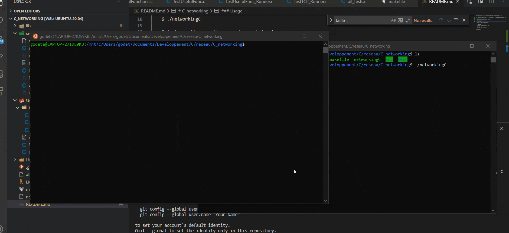

# C_networking
A small project allowing the user to make clients or server, send messages with sockets UDP or TCP


### Usage
In the terminal of a linux distribution (if you are using windows you can download Ubuntu in the microsoft store or use a VM with virtualbox) enter those commands :
```
    #download the repository
    $ git clone https://github.com/Godeta/C_networking.git

    #go inside the folder
    $ cd C_networking

    # compile the program and execute the tests
    $ make
    
    # start the program
    $ ./networkingC

    # (optionnal) erase the unused compiled files
    $ make clean

    # (optionnal) compile only the tests
    $ make tests
```

